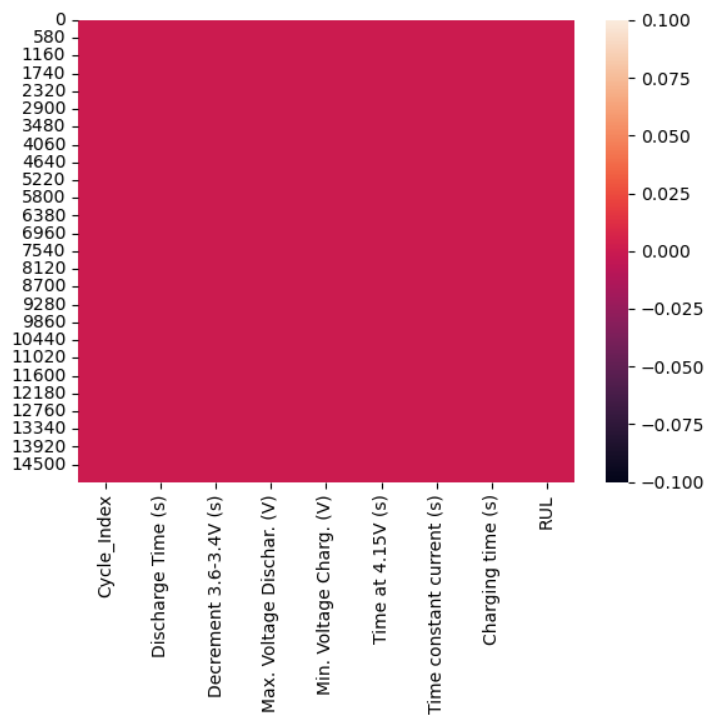

# Laporan Proyek Machine Learning
### Nama  : Ammar Umran Fauzi Ramadhan
### Nim   : 211351016
### Kelas : Pagi B

## Domain Proyek

Estimasi RUL Battery merupakan proyek yang bisa digunakan untuk mengetahui RUL pada Battery 

## Business Understanding

Efektifitas dalam penggunaan baterai

Bagian laporan ini mencakup:

### Problem Statements

- Ketidaktahuan bagi seseorang akan penggunaan pada baterai yang digunakan

### Goals

- Mengetahui Remaining Useful Life (RUL) pada baterai

    ### Solution statements
    - Mengembangkan platform berbasis web maupun aplikasi yang memberikan informasi tentang estimasi RUL pada Baterai yang digunakan.
    - Model yang dihasilkan dari datasets menggunakan metode Regresi Linear dan metrik evaluasi F1 Score.

## Data Understanding
Dataset yang saya gunakan adalah dataset yang berasal dari Kaggle. Dataset ini berisi tentang Institut Energi Alam Hawaii memeriksa 14 baterai NMC-LCO 18650 dengan kapasitas nominal 2,8 Ah, diputar lebih dari 1000 kali pada suhu 25°C dengan tingkat pengisian CC-CV C/2 dan tingkat pengosongan 1,5C. Dataset ini berisi 9 kolom dan 15,064 baris.<br> 

[Battery Remaining Useful Life (RUL)](https://www.kaggle.com/datasets/ignaciovinuales/battery-remaining-useful-life-rul/data).

### Variabel-variabel pada Heart Failure Prediction Dataset adalah sebagai berikut:
- Cycle_Index               : merupakan nomor perputaran = float64
- Discharge Time (s)        : merupakan waktu penggunaan baterai dalam satuan detik. = float64
- Decrement 3.6-3.4V (s)    : merupakan waktu pengurangan baterai pada saat 3.6-2.4V dalam satuan detik. = float64
- Max. Voltage Dischar. (V) : merupakan pelepasan tegangan maksimal dengan satuan Voltage. = float64
- Min. Voltage Charg. (V)   : merupakan muatan tegangan minimum dengan satuan voltage. - float64
- Time at 4.15V (s)         : merupakan waktu pengurangan baterai pada saat 4.15V dalam satuan detik. = float64
- Time constant current (s) : merupakan arus waktu konstan dalam satuan detik. = float64
- Charging time (s)         : merupakan waktu pengisian daya dalam satuan detik = float64
- RUL                       : merupakan target atau sisa masa manfaat pada baterai = int64

## Data Preparation

### Data Collection
Untuk data collection ini, saya mendapatkan dataset dari website Kaggle.

#### Deskripsi Library Yang Digunakan
``` bash
import pandas as pd
import numpy as np
import matplotlib.pyplot as plt
import seaborn as sns
from sklearn.model_selection import train_test_split
from sklearn.linear_model import LinearRegression
```

### Import File
``` bash
from google.colab import files
```

### Upload Token Kaggle
``` bash
files.upload()
```

### Membuat Folde Kaggle
``` bash
!mkdir -p ~/.kaggle
!cp kaggle.json ~/.kaggle/
!chmod 600 ~/.kaggle/kaggle.json
!ls ~/.kaggle
```

### Download Dataset
``` bash
!kaggle datasets download -d ignaciovinuales/battery-remaining-useful-life-rul --force
```

Kemudian, ekstrak file
``` bash
!mkdir battery-remaining-useful-life-rul
!unzip battery-remaining-useful-life-rul.zip -d battery-remaining-useful-life-rul
!ls battery-remaining-useful-life-rul
```

### Eksploratory Data Analysis Sederhana
Menampilkan isi dari dataset Battery_RUL.csv
``` bash
df.head()
```
Cek tipe data dari masing-masing atribut/fitur dari dataset Battery_RUL.csv
``` bash
df.info()
```
Gambar heatmap untuk mengecek apakah di dalam dataset ini terdapat nilai kosong
``` bash
sns.heatmap(df.isnull())
``` 
<br>
Cek detail informasi dari dataset Batter_RUL.csv ini
``` bash
df.describe()
```
Gambarkan visualisasi heatmap untuk melihat sebaran data pada dataset ini
``` bash
plt.figure(figsize=(10,8))
sns.heatmap(df.corr(),annot=True)
```
<br>
``` bash
models = df.groupby('Discharge Time (s)').count()[['Min. Voltage Charg. (V)']].sort_values(by= 'Min. Voltage Charg. (V)', ascending=True).reset_index()
models = models.rename(columns={'Min. Voltage Charg. (V)': 'numberOfBattery'})
```
``` bash
fig = plt.figure(figsize=(15,5))
sns.barplot(x=models['Discharge Time (s)'], y=models['numberOfBattery'], color='royalblue')
plt.xticks(rotation=60)
```
<br>

## Modeling
Lakukan seleksi fitur dengan memisahkan mana saja atribut yang akan dijadikan sebagai fitur dan atribut mana yang dijadikan label
``` bash
fitur = ['Discharge Time (s)', 'Decrement 3.6-3.4V (s)', 'Max. Voltage Dischar. (V)', 'Min. Voltage Charg. (V)', 'Time at 4.15V (s)', 'Time constant current (s)', 'Charging time (s)']
x = df[fitur]
y = df['RUL']
x.shape, y.shape
```
Lakukan split data, yaitu memisahkan data training dan data testing dengan script seperti berikut
```bash
x_train, X_test, y_train, y_test = train_test_split(x, y, random_state=70)
y_test.shape
```
Masukan data training dan testing ke dalam model regresi linier
``` bash
lr = LinearRegression()
lr.fit(x_train,y_train)
pred = lr.predict(X_test)
```
Cek akurasi
``` bash
score = lr.score(X_test, y_test)
print('akurasi model regresi linier = ', score)
```
Score yang dihasilkan adalah 0.7921858796477071 atau 79,21%. Selanjutnya kita coba model estimasi regresi linier ini dengan inputan
``` bash
input_data = np.array([[6621.1100, 720.000000, 9.121000, 2.428000, 4016.82000, 7.980000, 9963.111200]])
prediction = lr.predict(input_data)
print('Estimasi RUL : ', prediction)
```
Terakhir, export sebagai sav
``` bash
import pickle

filename = 'estimasi_battery_RUL.sav'
pickle.dump(lr,open(filename,'wb'))
```
## Evaluation
Disini saya menggunakan F1 Score sebagai metrik evaluasi

- F1 Score: F1 score adalah rata-rata harmonis antara presisi dan recall. F1 score memberikan keseimbangan antara presisi dan recall
``` bash
from sklearn.metrics import precision_recall_curve, f1_score

threshold = 800

y_pred_binary = (pred > threshold).astype(int)
y_test_binary = (y_test > threshold).astype(int)

f1 = f1_score(y_test_binary, y_pred_binary)

print('F1 Score:', f1)
```
Hasil yang didapat adalah 0.8467153284671534 atau 84,67%. Jadi, model ini memiliki keseimbangan antara presisi dan recall. Karena kita mencari tahu tentang sisa masa manfaat pada baterai maka model yang presisi diperlukan agar kefektifitasan dalam penggunaan baterai dan kemungkinan terjadinya kesalahan semakin sedikit.

## Deployment
[My Estimation App](https://app-baterai-rul-vou5e4fesj95bbj3c5ymdj.streamlit.app/)
